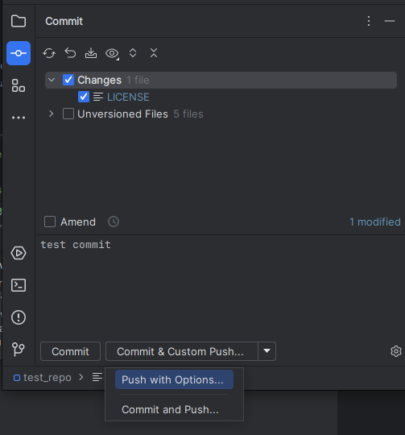
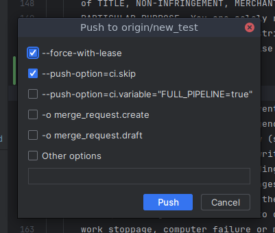

# Push with Options Intellij Plugin

Screenshots:

  
  



## Push Options File Config:
You need to add a file called ``.push-options`` in the repository root (no need to commit it) or user home directory.
The repository root placement takes precedence.

The push options file contains the list of push options:  
Example:
```
# Force push to remote
--force-with-lease
# skip running ci after push
-o ci.skip
# run a full pipeline
-o ci.variable="FULL_PIPELINE=true"
# create a merge request after push
-o merge_request.create
# create a draft merge request. It can be set in the same line with the merge_request.create
-o merge_request.draft
```
You can use `#` to comment lines.  
You can commit this config file and share it with other people contributing to the same repository

## Plugin Settings:
If you want to hide the intellij button "Commit and Push..." in the commit tool window, you can go to ``Settings > Tools > Git Custom Push`` and select ``Hide "Commit and Push..." button in the commit tool window``